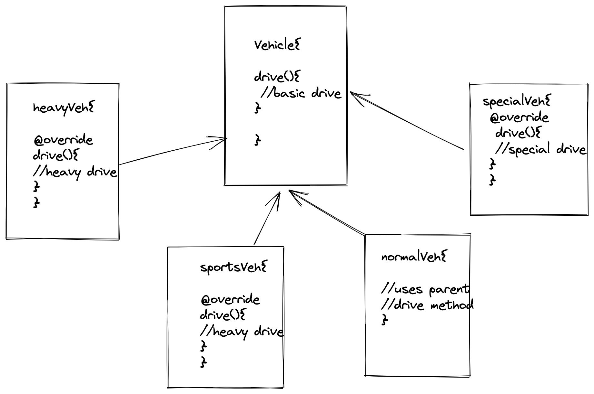
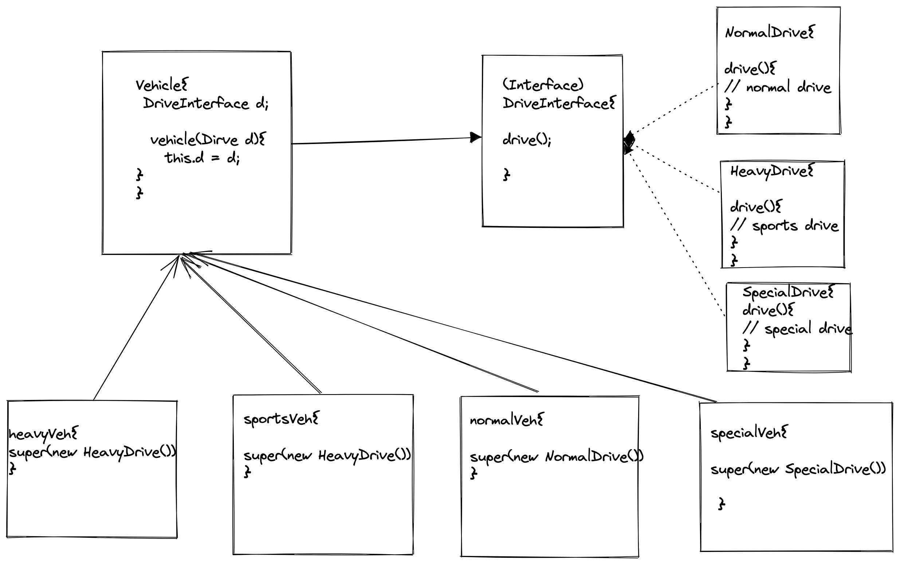

## Strategy pattern

In above example there is code duplicate as heavyVeh and sportsVeh uses same drive logic.

To solve this problem we can use strategy pattern

Using this pattern if in future any other new class require some new drive logic then new drive class can be added which implements DriveInterface().